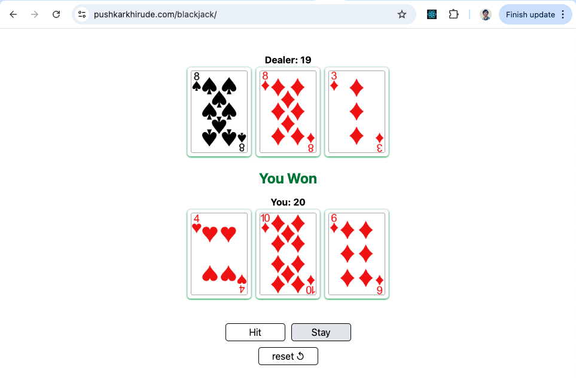

# 🃏 BlackJack

[](https://developer.mozilla.org/en-US/docs/Web/JavaScript)
[](https://reactjs.org/)
[](https://developer.mozilla.org/en-US/docs/Web/HTML)
[](https://developer.mozilla.org/en-US/docs/Web/CSS)
[](https://tailwindcss.com/)
[](LICENSE)

---

A simple, free-to-play Blackjack game built for the web — no betting, no accounts, just pure Blackjack fun!

## 🎮 Demo

[🔗 Play the Game](pushkarkhirude.com/blackjack)

## 🧩 Features

- Classic Blackjack gameplay (Hit, Stand, Bust, Blackjack)
- Dealer logic follows standard rules
- Clean and responsive UI for desktop and mobile
- Purely for fun – **no gambling or real-money betting**
- Lightweight and fast-loading

## 🛠️ Tech Stack

- **Frontend**: HTML, CSS, JavaScript _(or React, if applicable)_
- **Styling**: CSS / Tailwind / Bootstrap _(specify what you used)_

## 🚀 Getting Started

### Clone the Repo

```bash
git clone https://github.com/PushkarKhirude/blackjack
cd blackjack
```

### Run Locally

```bash
npm install
npm run dev
# click the localhost url provided by vite
```

## 📸 Screenshots

Click the Reset button to start a new round.


Click on the Hit button to deal more cards if you are not happy with your hand.


Click the Stay button if you are happy with your cards and to reveal delear's cards.


## ✨ Future Improvements

- Add animations and sound effects
- Track win/loss statistics

## 🤝 Contributing

Contributions are welcome! Feel free to open issues or submit pull requests for improvements or new features.

## 📄 License

This project is licensed under the [MIT License](LICENSE).

## 📬 Contact

Have feedback, found a bug, or just want to say hi?
Feel free to reach out or stalk me online (in a cool, non-creepy way 👀):

- 🧑‍💻 Creator: Pushkar Khirude

- 🐦 Twitter/X: @pushkarkhirude

- 💼 LinkedIn: Pushkar Khirude

- 🐙 GitHub: @PushkarKhirude

- 📮 Email: pushkar.khirude10@gmail.com

Built with ♥, caffeine ☕, and way too many rounds of testing “just one more hand” 🃏
